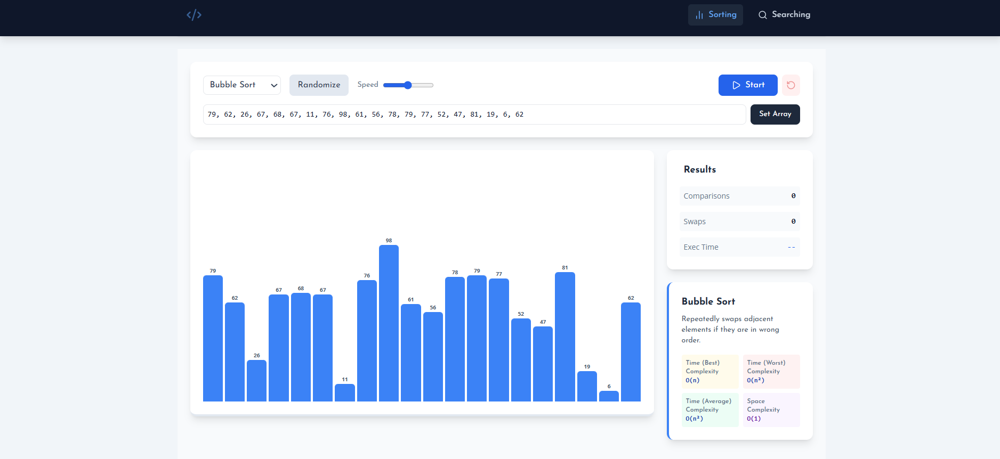
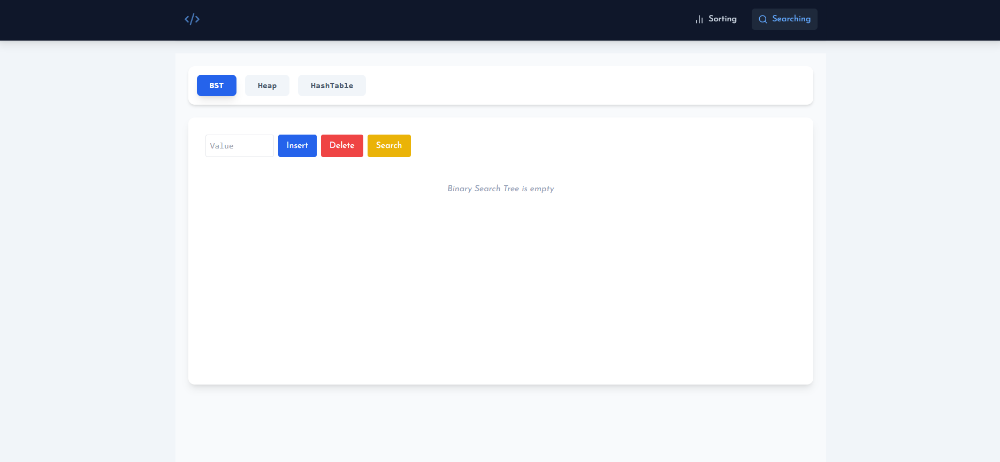
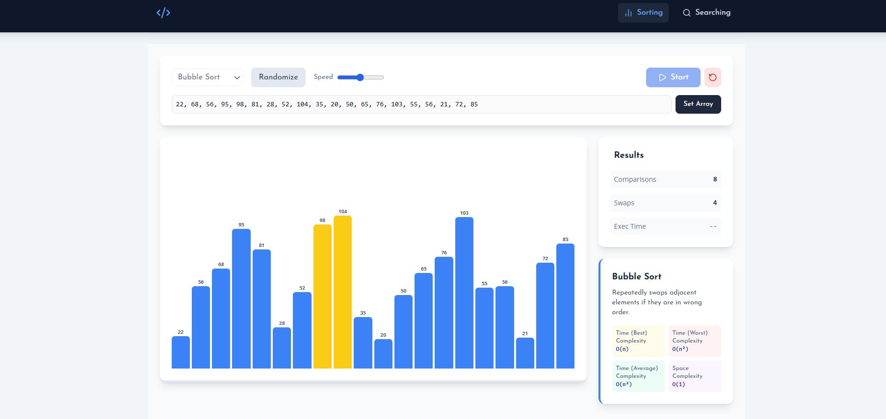
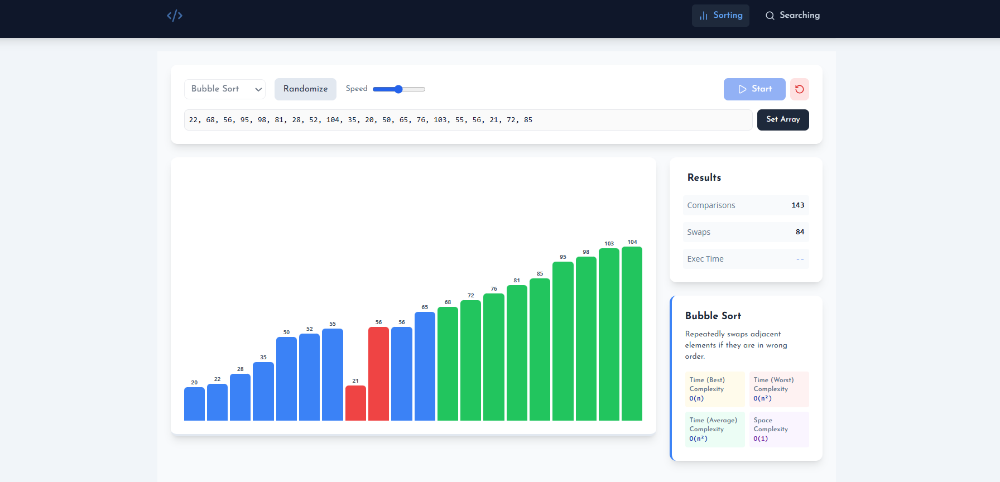
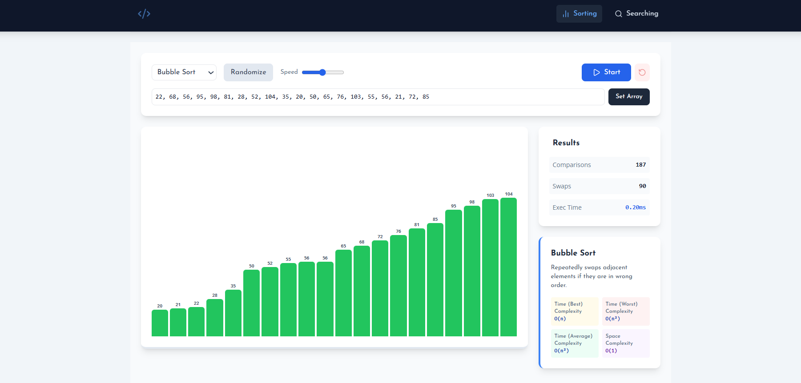
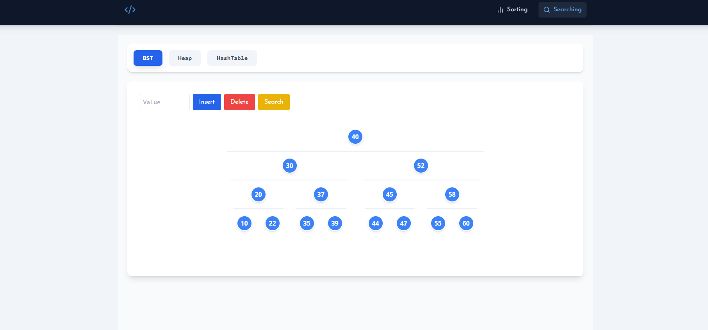
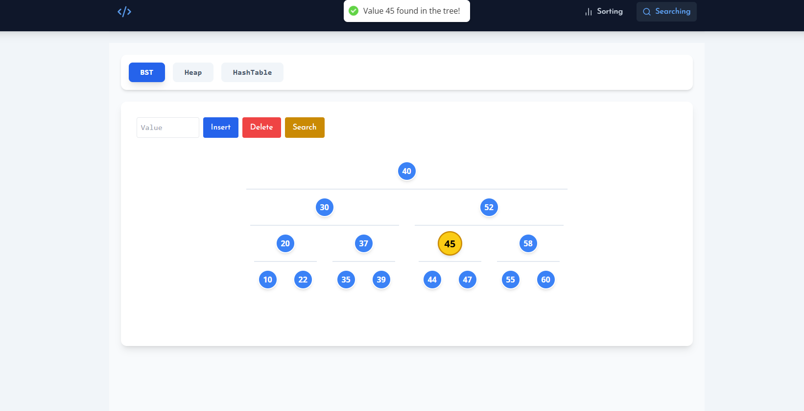
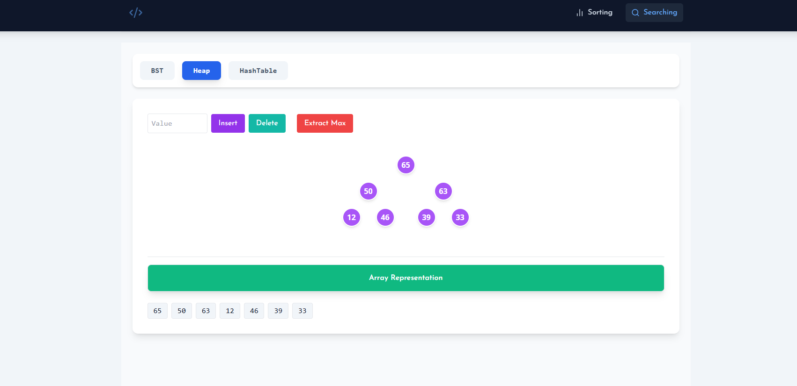
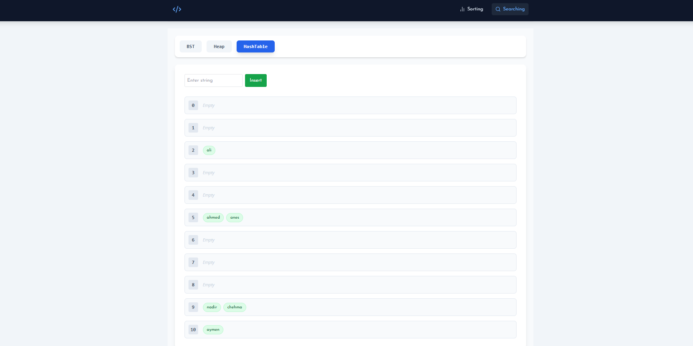

# 📊 Algorithm & Data Structures Visualizer
### *Academic Project - Data Structures & Algorithms (DSA)*

A comprehensive, interactive web application built with **React js** and **Tailwind CSS** to visualize the inner workings of fundamental computer science algorithms.

---

## 🖥️ Project Interfaces Preview



---

## 🚀 Key Features

### 1. Sorting Algorithms Visualizer
An interactive workspace to observe how different sorting techniques rearrange data.
* **Algorithms:** Bubble Sort, Selection Sort, Insertion Sort, Merge Sort, Shell Sort, and Quick Sort.
* **Visualization:** Color-coded bars representing array elements with real-time swapping animations :
Blue for default, yellow for comparison, red for swap, and green for sorted elements.
* **Controls:** Adjust array size and execution speed.

> **Visualizing Sorting:**




---

### 2. Searching & Data Structures Visualizer
A dedicated module for tree-based and table-based data structures with full CRUD support.

#### **🌲 Binary Search Tree (BST)**
* **Features:** Supports **Insertion**, **Search** , and **Deletion**.

> **BST Operations:**
> 
> 

#### **📉 Binary Heap (Max Heap)**
* **Features:** Supports **Insertion**, **Extraction (Root)**, and **Specific Node Deletion**.
* **Logic:** Visualizes the `bubbleUp` and `sinkDown` processes to maintain heap properties.
* **Representation:** Syncs a visual tree structure with the underlying array representation.

> **Heap Structure:**
> 

#### **🔑 Hash Table**
* **Features:** Visualizes string hashing and index mapping.

> **Hash Table Mapping:**
> 

---
## ⚡ Installation & Setup
Run the project locally:

```bash
# Clone the repository
git clone https://github.com/Naadix/Algorithm-Visualizer.git

# Navigate into the project folder
cd Algorithm-Visualizer

# Install dependencies
npm install

# Start the development server
npm run dev